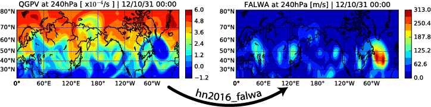

To learn about my academic presentation and publications, plesae visit my [official website](http://home.uchicago.edu/~csyhuang/).

### [Python Library: hn2016_falwa](http://github.com/csyhuang/hn2016_falwa)

The *hn2016_falwa* library computes Finite-Amplitude Rossby Local Wave Activity from gridded climate data of flexible resolutions.

### [Mini Data-Science Project: "Predicting Excitement at DonorsChoose.org"](http://github.com/csyhuang/DSaPP_RA_Project)

This is a side-project I worked on to apply for joining the [Data Science for Social Good](https://dssg.uchicago.edu/) program at UChicago as a part-time RA. It contains a short exploratory data analysis and a simple predictive model using logistic regression.

### [Webpage scrapping/Data retrival: ColumnAmountO3](https://github.com/csyhuang/ColumnAmountO3)

The python script *Aug7_2016_AutoRetrieval.py* in this repository (1) scrap the data file links, (2) downloading and (3) converting the satellite data (.he5) obtained by the ozone monitoring instrument (OMI) into ascii files. October 2, 2015 was the day with annual maximum Antarctic ozone hole. *(Note: NASA has changed the data retrieval protocol and requires credentials for downloading after the Rossbypalooza workshop, when the data was used. The script has to be updated to accommodate that.)*